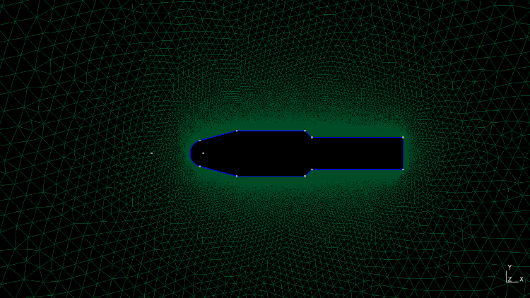
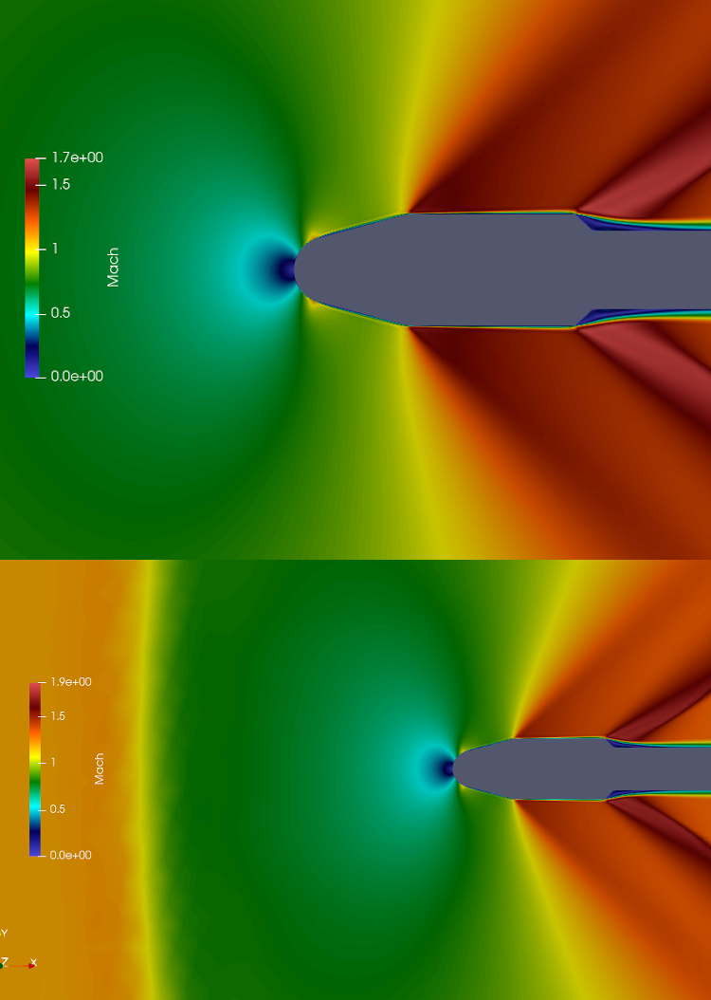
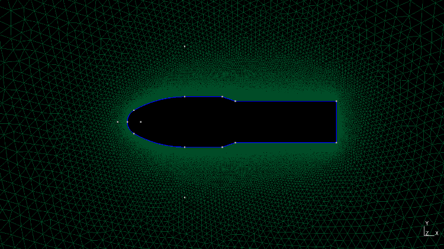
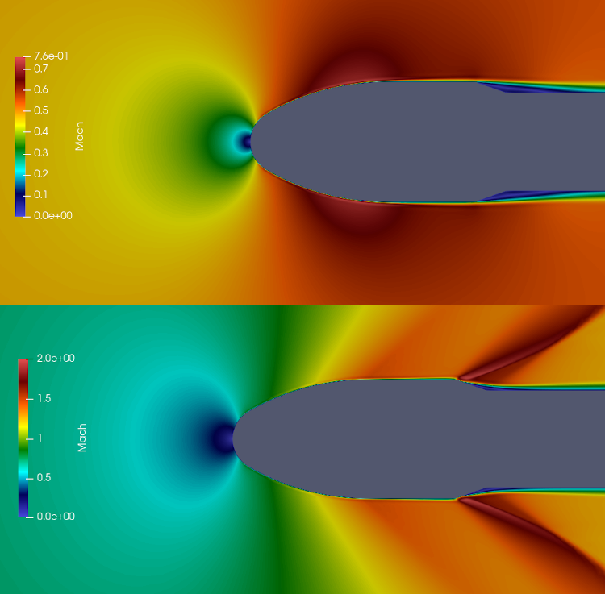

# CFD Flow Simulation of 2D PSLV and GSLV MK-III Fairing
> Flow simulation over pslv and gslv-mk3 fairings using SU2 solver.   

&nbsp;    
#### Update (27-DEC-22) : Tested with SU2 (Version-7.4.0) (no change in config needed)  

## Table of contents
* [Screenshots](#screenshots)
* [General info](#general-info)
* [References](#references)
* [Setup](#setup)
* [How to run ](#how)
* [Updates](#updates)
* [To-do list](#to-do)

## Screenshots
   
Simulated payload fairing 

> PSLV  
1.  Unstructured mesh fairing  
   
2.  Mach - 0.9 and 1.2, Angle-of-Attack - 0.0  
     

> GSLV Mk-III  
1.  Unstructured mesh fairing  
   
2.  Mach - 0.5 and 0.9, Angle-of-Attack - 0.0  
     

## General info
Included the minimalistic working geometry file for the 2D fairing flow simulation. 
&nbsp;   
&nbsp;    

## Setup
Tested the code on Linux based setup.    

1. Gmsh (Version-4.7.1) - Mesh generation
2. SU2 (Version-7.4.0) - CFD solver 
3. Paraview (Version-5.7.0) - flow visualization  

&nbsp;    
SU2 appears in two flavours. Single core/cpu version or MPI version for parallel computations.    
If you have multi-core processor, then MPI version speeds up the computation. You need to install MCICH   

## How to run   
>Download the files,       

>Single CPU mode:   
1.  Execute `SU2_CFD turb_SA_gslv_fairing.cfg` on terminal.    
2.  Open flow.vtu file through Paraview.    

>Parallel computation mode:   
1.  Execute `mpirun -n 4 SU2_CFD turb_SA_gslv_fairing.cfg` on terminal. (4-cores will be used, Only half on your pc might be allowed.)   
2.  Open flow.vtu file through Paraview.  

To execute PSLV, choose the turb_SA_pslv_fairing.cfg file in the command  

## Updates   
* [27-DEC-22] Tested to work with SU2 (Version-7.4.0)
* [12Mar2021] Included PSLV fairing geometry and configuration files 

## To-do list
* SSLV

