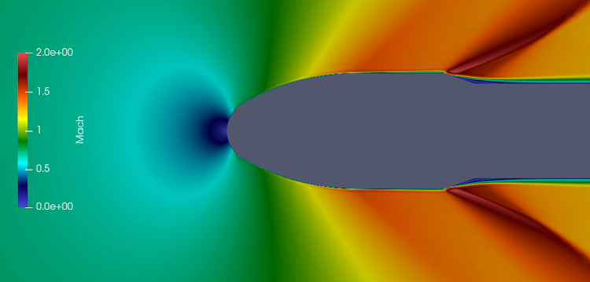
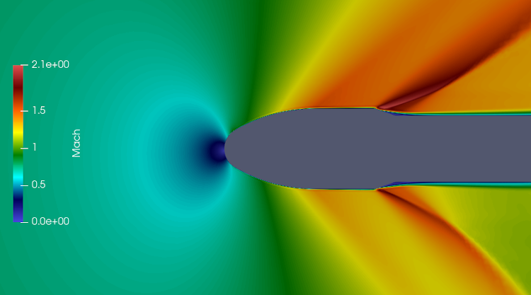
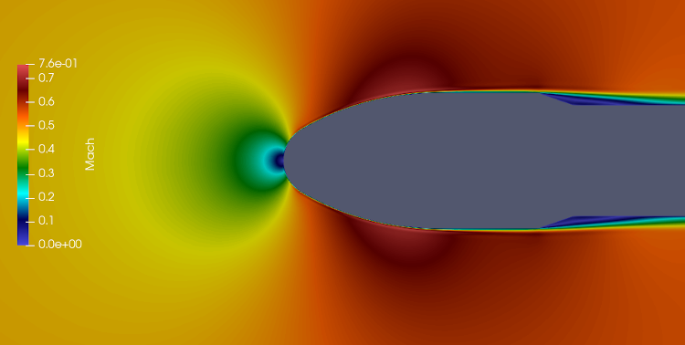
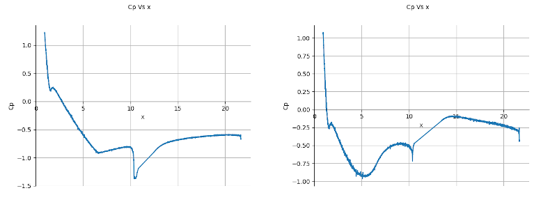

# CFD Flow Simulation of 2D GSLV MK-III Fairing
> Flow simulation over gslv-mk3 fairing using SU2 solver.   

## Table of contents
* [Screenshots](#screenshots)
* [General info](#general-info)
* [References](#references)
* [Setup](#setup)
* [How to run ](#how)
* [Updates](#updates)
* [To-do list](#to-do)

## Screenshots
   
#####Simulated payload fairing 

1.  Unstrustured mesh fairing  
   
2.  Mach - 0.9, Angle-of-Attack - 0.0  
     
3.  Mach - 0.9, Angle-of-Attack - 3.6   
         
4.  Mach - 0.5, Angle-of-Attack - 0.0   
         
5.  Center of Pressure : ( M-0.9 & M-0.5)  
   
6. 

## General info
Included the minimalistic working geometry file for the 2D fairing flow simulation. 
&nbsp;   
&nbsp;    

## Setup
Tested the code on Linux based setup.    

1. Gmsh (Version-4.7.1) - Mesh generation
2. SU2 (Version-7.1.0) - CFD solver 
3. Paraview (Version-5.7.0) - flow visualization  

&nbsp;    
SU2 appears in two flavours. Single core/cpu version or MPI version for parallel computations.    
If you have multi-core processor, then MPI version speeds up the computation. You need to install MCICH   

## How to run   
Download the files,       

#####Single CPU mode:   
1.  Execute `SU2_CFD turb_SA_gslv_fairing.cfg` on terminal.    
2.  Open flow.vtu file through Paraview.    

#####Parallel computation mode:   
1.  Execute `mpirun -n 4 SU2_CFD turb_SA_gslv_fairing.cfg` on terminal. (4-cores will be used, Only half on your pc might be allowed.)   
2.  Open flow.vtu file through Paraview.  

## Updates   

## To-do list
* 

